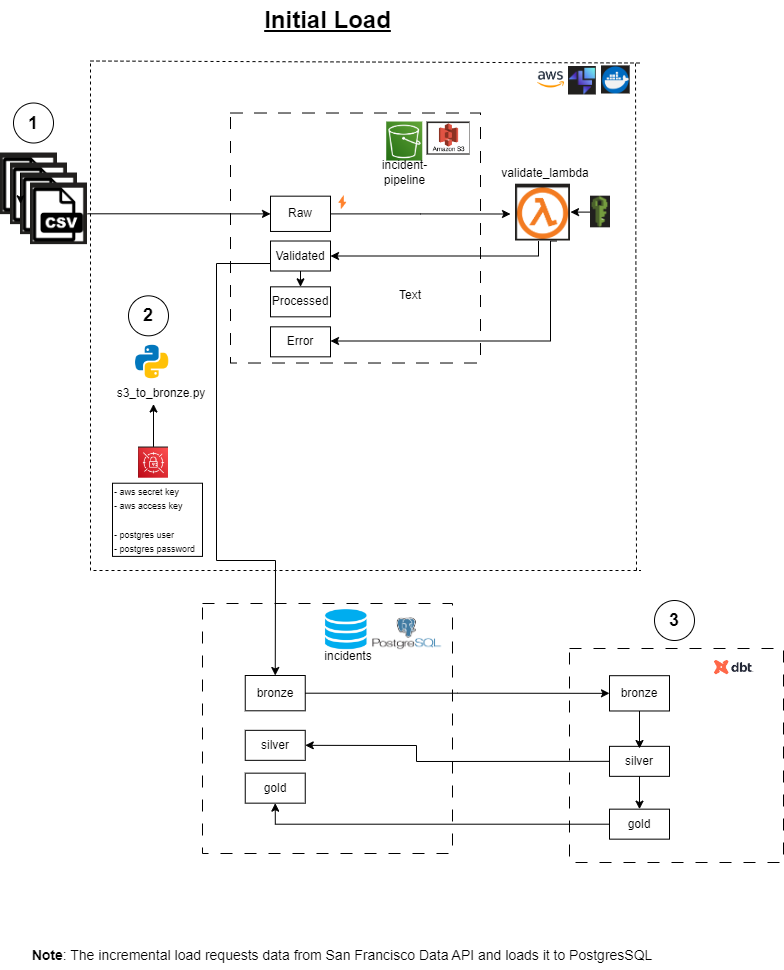

# TN-CHALLENGE  
## Building an Incident Pipeline




## Assumptions
1. You can run Docker
2. This guide is for Windows
3. You have 7zip installed
4. The incidents are always new. They are not updated or deleted.
5. The volume of daily incremental loads does not exceed 1000 rows.


## Database setup

1. Database and schema creation 
From Git Bash terminal, run:  
```bash
docker run --rm --name postgis_container -e POSTGRES_USER=admin -e POSTGRES_PASSWORD=admin -e POSTGRES_DB=incidents -p 5432:5432 -d postgis/postgis
```
In a PostgresSQL client run *sql_creation.sql*, located in incident-pipeline/helpers


## Steps to set up the environment - INITIAL LOAD
1. Open a new Command Prompt and create a virtual environment venv.
   
2. Standing in the incidnet-pipeline directory, activate the venv and run pip install -r requirements.txt

3. Start a Docker container using the LocalStack image  
Docker Desktop should be up.  
Open a new Command Prompt and run:  
```cmd
docker run --rm -it --name localstack -p 4566:4566 -e PROFILE=localstack -e SERVICES=secretsmanager,cloudwatch,lambda,s3,logs,iam -e DOCKER_HOST=unix:///var/run/docker.sock -v /var/run/docker.sock:/var/run/docker.sock -e LAMBDA_EXECUTOR=host -e DEBUG=1 -e AWS_ACCESS_KEY_ID=test  -e AWS_SECRET_ACCESS_KEY=test -v C:\Users\anben\.aws:/root/.aws:ro localstack/localstack
```

You can list the existing containers using the command **docker ps**  
To check status run **curl http://localhost:4566/_localstack/health**  

   
4. Configure localstack profile  
From Git Bash terminal, run:  
```bash
aws configure --profile localstack
```
You will be asked to enter AWS Access Key ("test", for example), AWS Secret Access ("test", for example), default region name (answer us-east-1) and default output format (answer json)  
This command creates the *C:\Users\<user>\.aws* directory, with config and credentials files in it.  

Add the following to config file:  
[profile localstack]  
region = us-east-1  
output = json  
s3 =  
    endpoint_url = http://localhost:4566  
secretsmanager =  
    endpoint_url = http://localhost:4566  


5. Build AWS infrastructure  
Standing in *incident-pipelinerun/builds* directory, run the following command from a Git Bash terminal,:   
```bash
./build_1.sh
```
This will:
- create incidents-pipeline S3 bucket
- create an IAM role
- create the validate_lambda lambda function

6. Check validate_lambda function state  
```bash
aws --endpoint-url=http://localhost:4566 --profile localstack lambda get-function \
    --function-name validate_lambda \
    --query 'Configuration.State' \
    --output text
```

7. When the lambda state is Active, run the following:
```bash
./build_2.sh
``` 
This will:
- extend Lambda Function timeout 
- add a trigger to S3 bucket to run the lambda function 

8. Upload secrets to Secrets Manager  
Create the following json files:  
**aws_secrets.json**  
{  
  "aws_access_key_id": "*write your access key*",  
  "aws_secret_access_key": "*write your secret key*"  
}  

**postgres_secrets.json**  
{  
  "postgres_user": "*write your user*",  
  "postgres_password": "*write your password*"  
}  


Standing in the directory where you put *postgres_secret.json* and *aws_secrets.json*, run the following commands, in a Git Bash terminal:  
```bash
aws secretsmanager create-secret --name AWSSecrets --secret-string file://aws_secrets.json --profile localstack --endpoint-url=http://localhost:4566
aws secretsmanager create-secret --name PostgresSecrets --secret-string file://postgres_secrets.json --profile localstack --endpoint-url=http://localhost:4566
```

To update the secrets, you can run, for example:
```bash
aws secretsmanager update-secret --secret-id PostgresSecrets --secret-string file://postgres_secrets.json --profile localstack --endpoint-url=http://localhost:4566
```

## Steps to run incident-pipeline  
### Step 1 - Upload all the files to S3  
Standing in the *incident-pipeline/config* directory run the following commands to upload the column names mapping to s3://incidents-pipeline/config:  
```bash
aws s3 cp columns_map.json s3://incidents-pipeline/config/columns_map.json --endpoint-url=http://localhost:4566 --profile localstack
```

Standing in the *incident-pipeline/raw* directory run the following commands to upload the files to s3://incidents-pipeline/datasets:  
```bash
aws s3 cp test.sql s3://incidents-pipeline/datasets/raw/test.sql --endpoint-url=http://localhost:4566 --profile localstack

aws s3api put-object --bucket incidents-pipeline --key datasets/raw/fire_incidents.csv --body fire_incidents.csv --endpoint-url=http://localhost:4566 --profile localstack
```


You can check files location.  
Wait a minute and run the following to check if the files were validated and moved to s3://incidents-pipeline/datasets/validated  
```bash
aws --endpoint-url=http://localhost:4566 --profile localstack s3 ls s3://incidents-pipeline --recursive
```
**Notes**
- The current file fire_incidents.csv is valid. Please, wait till it is moved to datasets/validated. 
- If a file is not a CSV file, it is moved to s3://incidents-pipeline/datasets/error  
- You can also check the logs from the docker terminal  
- To remove a file, you can run the following: 
```bash
aws s3 rm s3://incidents-pipeline/datasets/validated/fire_incidents.csv --endpoint-url=http://localhost:4566 --profile localstack
aws s3 rm s3://incidents-pipeline/datasets/error/test.sql --endpoint-url=http://localhost:4566 --profile localstack
```

### Step 2 - Run s3_to_bronze script  
From a Command Prompt with venv active, standing in incidents-pipeline, run:  
```cmd
python -m scripts.s3_to_bronze
```
It takes the files from datasets/validated and loads the following table:  
- incidents.bronze.br_incidents

You can check the console logs to check number of rows before and after insertion and query the tables in PostgresSQL.  

*Notes*   
- This scripts also generates profiles.yml file dynamically, to be used with dbt.
  
### Step 3 - Run dbt  
Standing in the incidents-pipeline/dbt directory, in the Command Promt, run:  
```cmd
dbt run
```
dbt will test, transform and load the data to the following tables in PostgresSQL:  
**schema: silver**
- sl_fire_incidents


**schema: datamarts**
- dim_date
- fact_fire_incidents

## Steps for INCREMENTAL LOADS
### Step 1 - Run incremental_api_to_bronze script  
From a Command Prompt with venv active, standing in incidents-pipeline, run:  
```cmd
python -m scripts.incremental_api_to_bronze
```
It requests the San Francisco Data API and loads the following table:  
- incidents.bronze.br_incidents
  
### Step  - Run dbt  
Standing in the incidents-pipeline/dbt directory, in the Command Promt, run:  
```cmd
dbt run
```


## Analytics
Some queries for the analysis are located in incidents-pipeline/analytics/analysis.sql  


## Some proposed enhacements
**Python**:
- Refactor to clean the code
- Document functions and modules
- Create more functions in utils.py module 
- Add more logs
- Use PySpark if it is big data  

**dbt**:
- Add more validations
- Add schema.yml files and descriptions for all the models, to be able to generate documentation (dbt docs generate command)
- configure store_failures: true. Reports could be generated   
  
**Others**:
- Integrate Airflow 
- Use CloudFormation for CI/CD
- Include unit tests 
- Implement backup mechanism
